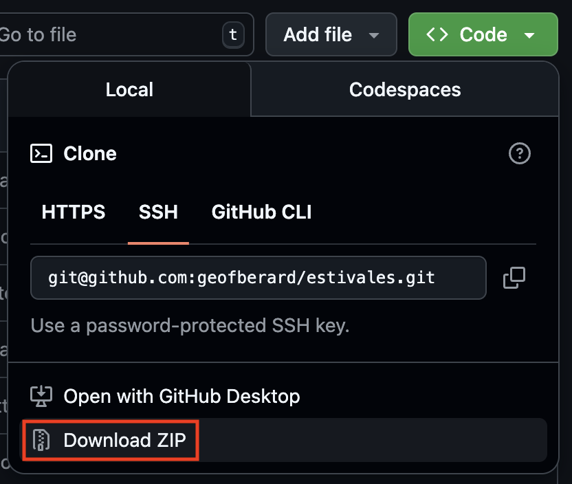
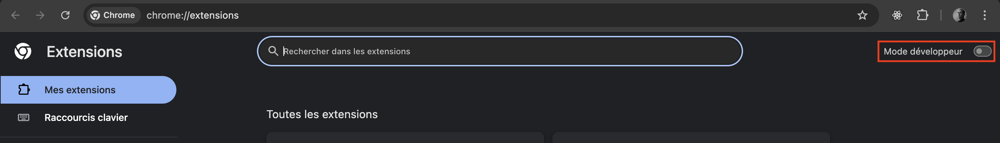
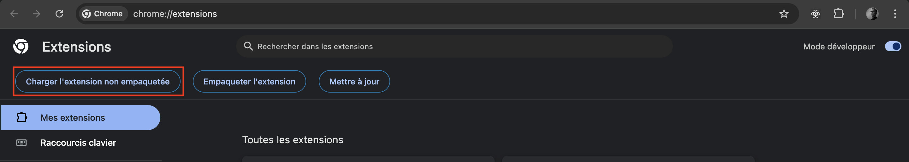
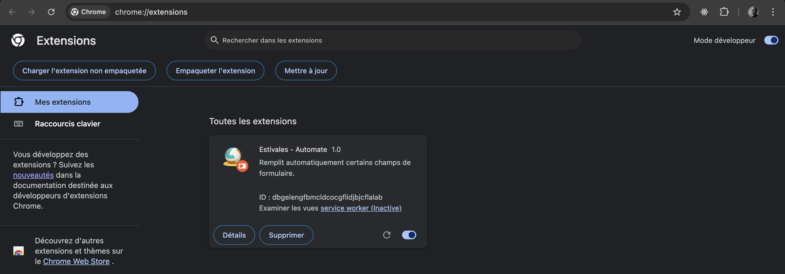
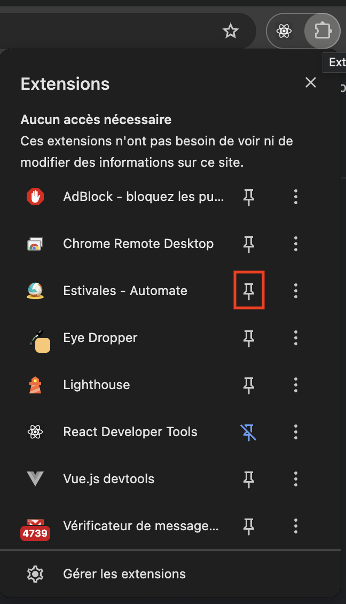
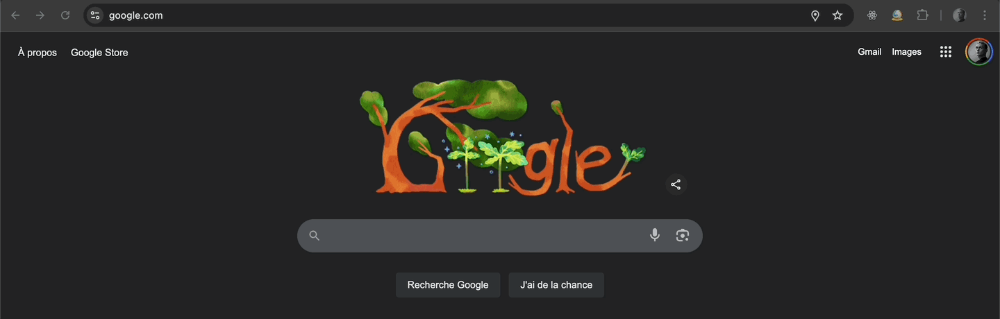
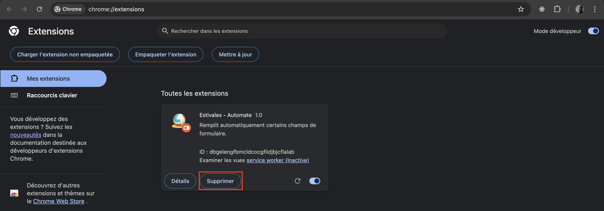
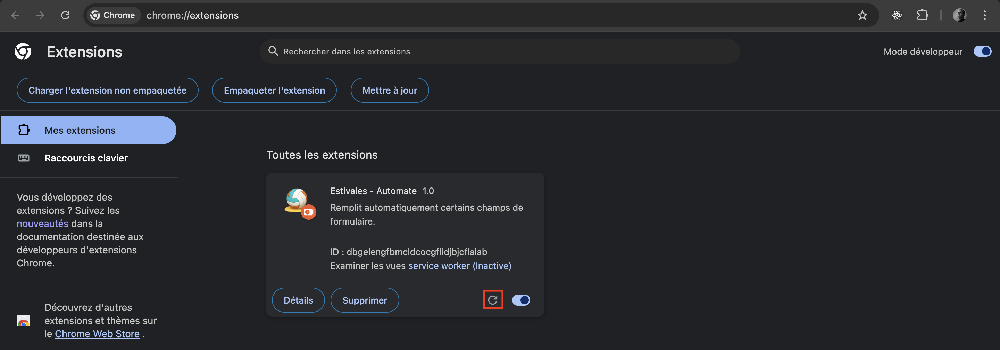

#  Estivales - Automation

## 🛠️ Prérequis

- Un talent indéniable pour le volley-ball
- Google Chrome (à jour de préférence)
- (optionnel) Git

## 📥 Télécharger l’extension

Choisissez l’option qui vous met le plus à l’aise :

### Option 1 : “Mais c’est quoi ce site ?” 🐣

Pas besoin de compétence en développement ! Tout peut se faire à la souris.

1. Cliquez sur le bouton `Code` > `Download ZIP` sur la page actuelle.
   <br/>

Pour les plus feignants, vous pouvez aussi cliquer directement
[ici](https://www.youtube.com/watch?v=dQw4w9WgXcQ&ab_channel=RickAstley) ou
[la](https://github.com/geofberard/estivales/archive/refs/heads/main.zip)

2. Décompressez le fichier téléchargé (clic droit > “Extraire tout…” ou “Ouvrir” selon votre système).

### Option 2 : “Quand est-ce qu’on voit du code ?” 🥷

Pour les personnes utilisant Git :

```shell
  git clone git@github.com:geofberard/estivales.git
```

## 🧩 Installer l’extension

1. Ouvrez un nouvel onglet Chrome et saisissez :

```
chrome://extensions
```

2. Activez le mode développeur en haut à droite.
   

3. Cliquez sur “Charger l’extension non empaquetée”.
   

4. Sélectionnez le dossier contenant l’extension
    - `estivales-main` si vous avez utilisé **l'option 1**
    - `estivales` avec **l'option 2**.

5. L’extension apparaît dans la liste, prête à être utilisée ! 🎉
   

6. Cliquez sur l’icône “épingler” pour l’ajouter à la barre d’outils.
   <br/>

## ⚙️ Configurer l’extension

1. Faites un clic droit sur l’icône de l’extension.

2. Cliquez sur `Options`.
   

3. Renseignez les informations nécessaires à l’inscription de votre équipe.

## 🚀 Utilisation de l’extension

- L’extension s’active automatiquement sur les pages du site HelloAsso.
- Elle remplit toutes les étapes de l’inscription avec les données que vous avez configurées.
- Une notification s’affiche une fois la page de paiement atteinte.
- Pour accéder rapidement à un tournoi spécifique : cliquez sur l’icône de l’extension et choisissez le tournoi voulu.


## 🗑️ Supprimer l'extension

Retournez sur la page de gestion des extension (`chrome://extensions`) et supprimez l'extension.



```
chrome://extensions
```

## 🔄 Mettre à jour l’extension

Si une nouvelle version est disponible, voila comment le mettre a jours en fonction de l'option d'installation choisie

### Option 1 🐣

On supprime tout et on recommence !

1. Suivez la précédure "Supprimer l'extension"
2. Suivez la précédure "Télécharger l'extension"
3. Suivez la précédure "Installer l'extension"

### Option 2 🥷

1. Dans le dossier cloné via Git, exécutez :

```shell
  git pull
```

2. Retournez sur la page `chrome://extensions` pour recharger l’extension



